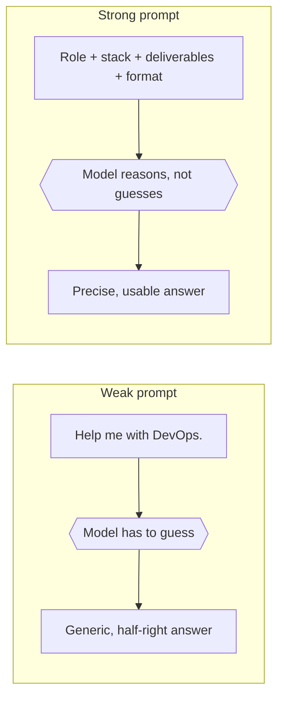
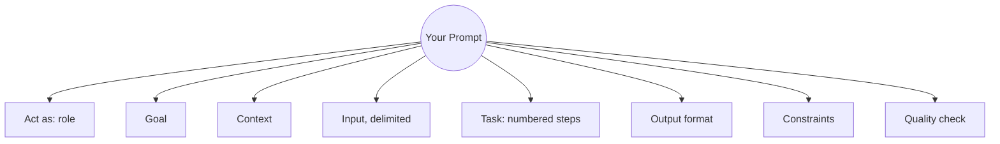

For a long time I used AI the way I use a search engine: type a few words, hit enter, hope. *"Help me with DevOps." "Fix this pipeline." "Explain EKS."* Back would come something generic, half-right, or confidently wrong — and I'd quietly blame the model.

The uncomfortable truth is that the model was doing exactly what I asked. **The problem was the ask.**

This series is me getting deliberate about that — treating prompting the way I'd treat any other engineering skill I'm trying to level up: pattern by pattern, with examples I actually use.

In this part:

- What a prompt really is — and why it isn't a search query
- The weak-vs-strong test: same intent, radically different output
- Why sloppy prompts cost more in DevOps than in almost any other job
- The reusable skeleton: `Act as → Goal → Context → Input → Task → Output → Constraints → Quality check`
- Where the series goes from here

---

## A prompt is a blueprint, not a search query

A prompt is the instruction, question, or input you hand to an AI. It shapes what the AI creates and how it responds. Your words are the blueprint — and a vague blueprint produces a vague building.

The fastest way to feel this is to hold the *intent* constant and change only the *specificity*. Same goal, two very different prompts:

**Weak:**

> Help me with DevOps.

**Strong:**

> Act as a senior DevOps architect. Explain how Jenkins CI, Azure DevOps CD, Terraform, AWS EKS, ArgoCD, Datadog, Slack, and Jira connect in an enterprise delivery platform. Give the architecture, the data flow, the risks, and an implementation roadmap.



The weak version forces the model to guess what I want — which topic, which depth, which format, which audience. It guesses generically, because generic is the safest guess. The strong version removes the guessing. It names the role, the stack, the deliverables, and the shape of the answer. There's almost nothing left to get wrong.

That's the whole game in one sentence: **the less the model has to guess about what you want, the more likely you are to get it.**

---

## Why this matters more for us than for most

Good prompting improves four things at once — accuracy, relevance, productivity, and cost-efficiency — and it kills the endless back-and-forth where you re-explain yourself five times.

> ⚠️ **Weak prompting's usual suspects:** hallucinations · unusable code · repetitive filler · wrong math · baked-in bias · answers that contradict themselves two paragraphs apart.

For a DevOps engineer, those failure modes aren't cosmetic. A hallucinated Terraform resource that doesn't exist in the provider. A confidently wrong `kubectl` flag. An IAM policy that looks plausible and quietly grants more than you meant. Each of these costs real minutes — sometimes an incident — and every one of them is more likely when the prompt was lazy. The quality of the output is capped by the quality of the input, and in our world the cost of a bad output is higher than in most.

There are three areas where this compounds for me, and probably for you:

- 🚀 **Career** — DevOps depth, AWS, the Cloud Architect track, everything I'm studying toward the next level.
- ✍️ **Content** — blog posts, scripts, AI images and video, the "learning loud" habit.
- ⏱️ **Personal productivity** — my learning roadmap, trading notes, expense tracking, the small stuff that eats a day if you let it.

Prompting well is the multiplier that sits underneath all three. Get it right once and every future interaction gets cheaper.

---

## The anatomy of a strong prompt

Here's the skeleton I now reach for whenever a task actually matters. It isn't magic — it's just every good prompting tactic (include details, adopt a persona, delimit your input, specify the steps, give examples, state the format) collapsed into one reusable shape:

```text
Act as: [role / persona]

Goal:
[what I want to achieve]

Context:
[background, audience, current situation, constraints]

Input:
"""
[paste code, logs, notes, data, problem, PDF text, etc.]
"""

Task:
1. [step 1]
2. [step 2]
3. [step 3]

Output format:
[table / bullets / roadmap / YAML / script / prompt / checklist]

Constraints:
- Avoid [things you do not want]
- Use [tone / style / length]
- Assume [important assumptions]

Quality check:
Before the final answer, verify accuracy, missing gaps, and practical usefulness.
```

Same skeleton, at a glance:



A few things worth understanding about *why* each field pulls its weight:

🎭 **Act as** sets the reasoning altitude. "Act as a senior DevOps architect" gets you architecture-level thinking; no role gets you the average of the entire internet. Personas are the cheapest quality upgrade available.

🧭 **Context** is where most of us underinvest. The model doesn't know your stack, your skill level, or your audience unless you tell it. Two sentences of context ("I'm a Principal DevOps engineer, this is for SA-Pro-level depth, the audience is my own future reference") reshapes the entire answer.

📦 **Input, wrapped in delimiters,** is the single habit that prevents the most confusion. Triple quotes or XML tags around your pasted logs, code, or draft tell the model *"this is material to work on, not instructions to follow."* Skip this and it will occasionally treat your log file as a command.

✅ **Task as numbered steps** turns a fuzzy request into a checklist the model can actually complete without dropping half of it.

🎯 **Output format and constraints** are you deciding the shape of the answer instead of accepting whatever comes out. "Give it as a table with these columns" or "keep it under 300 words, no marketing tone" saves the round trip where you ask for a reformat.

🔍 **Quality check** is a small instruction with an outsized effect: asking the model to verify its own work before answering measurably reduces sloppy mistakes. More on why that works in a later part.

You won't use every field every time — and you shouldn't. For a quick lookup ("what's the default TTL on a Route 53 alias record?"), the skeleton is overkill; just ask. But for anything you'd otherwise iterate on three or four times, filling in this structure once is the difference between one good answer and five mediocre ones.

> 💭 **Reflection prompt:** Pull up the last AI prompt you actually sent. Not a hypothetical — the real one, still in your history. Which of the eight fields above did it have? If the honest answer is one or two, that's not a failure, it's just where the ceiling is right now.

### Quick gut-check before you hit enter

- [ ] Does my prompt name a **role**, or am I letting the model default to "generic internet average"?
- [ ] Have I stated the **goal** in one explicit sentence, not implied it?
- [ ] Did I give **context** the model has no way of knowing on its own?
- [ ] Is anything I pasted in wrapped in delimiters — or is it floating loose where it could be misread as an instruction?
- [ ] Did I number the **steps**, instead of describing the task in one paragraph?
- [ ] Did I specify the **output format** — or am I hoping it guesses right?
- [ ] Did I ask it to **verify its own answer** before handing it to me?

---

## What's next

The skeleton above is the *how* — how to phrase any serious prompt. **Part 2** is the *which* and the *what*: the twelve prompt types — zero-shot, few-shot, persona, chaining, negative, reference-text & more — and then the copy-paste playbook, the exact prompts I use for AWS learning, pipeline troubleshooting, and script writing.

| Part | Topic |
|:--|:--|
| **Part 1 — You are here** | Why Prompting Is a DevOps Skill |
| [Part 2](/blog/prompt-engineering-mastery-part-2-the-12-prompt-types) | The 12 prompt types, when to use each, and the copy-paste prompt playbook |

If you take one thing from Part 1, take this:

> **Stop blaming the model. Start engineering the ask.**
