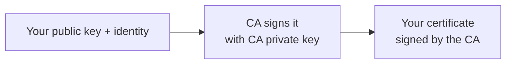
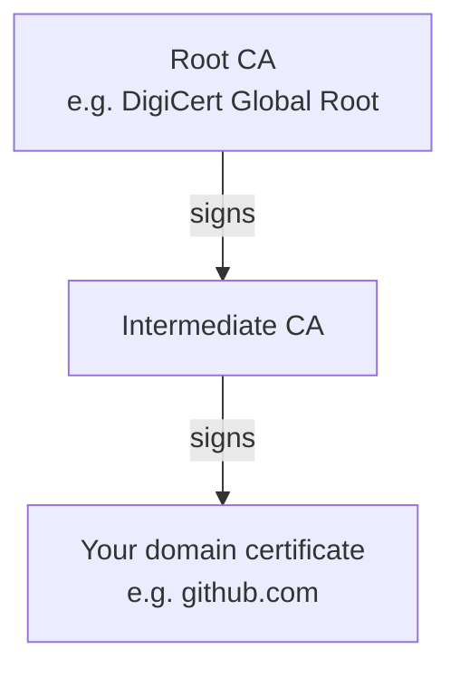
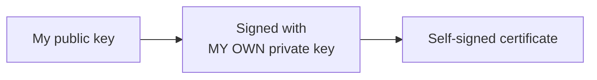
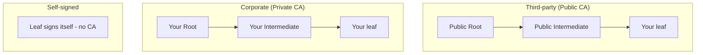

In [Part 1](/blog/tls-mastery-part-1-why-tls-exists) we covered cryptography, hashing, and symmetric vs asymmetric keys. Now let's use those ideas to understand the trust machinery behind HTTPS.

In this part:

- HTTPS in one line
- What a certificate actually contains
- Certificate Authorities (CA) and how **signing** creates trust
- Root and intermediate CAs (the certificate chain)
- Public Key Infrastructure (PKI)
- Self-signed certificates and their trade-offs
- The **three certificate types** compared (public, corporate, self-signed)

---

## HTTPS in one line

**HTTPS is simply HTTP wrapped in TLS encryption.** Plain HTTP sends data in the clear; HTTPS encrypts the communication between client (usually your browser) and server.

Modern browsers flag plain HTTP as **"Not secure"** and often make you click through warnings. HTTPS gives you the padlock. Benefits:

- Your site looks **legitimate and trustworthy**.
- **SEO** — search engines favour HTTPS.
- Protection from **sniffing**, since the data is encrypted.

What makes HTTPS possible? A **certificate**.

---

## What is a certificate, really?

A certificate is **proof of identity for a domain**. It tells visitors: *"This domain genuinely belongs to me."* When a bank has a valid certificate, you can trust you're talking to the real bank.

A certificate contains, among other things:

- The owner's **public key**
- The **domain name(s)** it's valid for
- The name of the **CA** that issued it
- A **validity period** (certificates aren't valid forever — typically months to a year, then renewed)

> **Remember this:** whenever you see "certificate", think *"a wrapper around a public key, plus identity info"*. The matching private key is **never** inside the certificate.

But here's the catch: **anyone can generate a public/private key pair.** An attacker can spin up `bankk.com` and generate their own keys too. So a raw public key proves nothing. We need a trusted third party to vouch for it.

---

## Certificate Authorities (CA) and the chain of trust

A **Certificate Authority (CA)** is a trusted third party that verifies domain ownership and then issues (signs) certificates. Well-known public CAs include DigiCert, GlobalSign, GoDaddy, Sectigo (formerly Comodo) and others.

Before issuing, a CA performs verification — checking domain ownership, sometimes emailing you, checking organisation records. An attacker running a fake bank simply fails this, so no certificate is issued.

### How signing creates trust

Everyone here has a key pair — the CA, your server, even users. When a CA issues your certificate, it:

1. Takes **your domain's public key** (plus your identity info).
2. **Signs** it with the **CA's own private key**.

Why does this help? Because the matching **CA public key is already built into every browser and operating system**. You can see the list yourself:

> **Browser → Settings → Privacy and security → Security → Manage certificates → Trusted Root Certification Authorities**

When your browser receives a certificate, it uses the CA's public key (already trusted) to **verify the signature**. If it checks out, a genuine CA signed it — padlock. If not — warning.

> **A precise note:** "signing" is not the same as "encrypting with the private key", even though older explanations describe it that way. A signature is a cryptographic operation that anyone can *verify* with the public key but only the private-key holder can *produce*. The end result is the same trust guarantee — just don't mix up *signing/verifying* with *encrypting/decrypting*.

### Root and intermediate CAs (the certificate chain)

In practice, a top-level **root CA** rarely signs domain certificates directly. It delegates to **intermediate CAs**, which sign the actual domain (leaf) certificates. This forms a **certificate chain**:

Click the padlock on any HTTPS site — certificate details, and you'll see exactly this hierarchy. A **root certificate** is just the CA's own public certificate. Roots are **self-signed** (a root signs its own certificate, because there's no higher authority) — which is fine, because roots are pre-distributed and trusted.

> **Why intermediates?** They let the precious root key stay offline and protected. If an intermediate is compromised, it can be revoked without invalidating the root. Your server should always serve the **full chain** (leaf + intermediates) so clients can build the path to a trusted root — a common misconfiguration is serving only the leaf.

---

## Public Key Infrastructure (PKI)

The whole system that issues, manages, revokes and tracks certificates is **Public Key Infrastructure (PKI)**. Running "your own PKI" means operating your own internal CA and managing certificates internally.

Key components:

- **Certificate Authority (CA)** — issues certificates.
- **Registration Authority (RA)** — verifies *who* is requesting, so only valid users/devices can.
- **Certificate database / central directory** — stores issued certificates and keys.
- **Policies** — rules for issuance, validity, and revocation.

> **Public vs private/internal CAs:** Public CAs only certify publicly reachable domains. For securing internal services (server-to-server traffic inside an org), you run a **private CA** — a private offering from a public CA, or your own (e.g. Microsoft AD CS). We'll build our own CA by hand in Part 5.

---

## Self-signed certificates

What if you don't want to (or can't) go to a CA — say, for testing? You can sign your own public key with **your own private key**. That's a **self-signed certificate** — not vouched for by any external CA.

**Advantages:**

- You're your own CA — **no cost**, no waiting, no external verification.
- Create as many as you like.
- Quickly enable HTTPS in **test environments**.

**Disadvantages:**

- Browsers **won't trust** it (errors like *"certificate authority invalid"*). The traffic *is* encrypted, but the identity isn't verified.
- **Not for production** or public-facing sites.
- **Hard to track/manage** at scale; security teams usually disallow them.

Encryption without trusted identity isn't enough for the public internet — which is exactly the gap CAs fill.

---

## The three certificate types — really "who signs your chain"

People talk about "third-party", "corporate", and "self-signed" certs as different things. They're the **same x509 certificates**, differing in only one way: **who controls the chain that signs them.**

| | Third-party (Public CA) | Corporate (Private CA) | Self-signed |
|---|---|---|---|
| Who signs | Public CA (DigiCert, Let's Encrypt) | Your org's CA | The cert itself |
| Trusted by default | Everyone | Only devices with your root | Nobody |
| Cost | Free (Let's Encrypt) — paid | Your infra/ops effort | Free |
| Internal names (`*.svc.cluster.local`) | ✗ **Not allowed** | ✓ Yes | ✓ Yes |
| Best for | Public, internet-facing sites | Internal services, mTLS | Local testing |

- **Third-party / public CA** — they own the root and intermediate; **you create only the leaf** (key + CSR) and they sign it. Trusted everywhere automatically.
- **Corporate / private CA** — *your org* owns the root (and usually an intermediate); trusted only by devices that have your root installed. The standard for internal services.
- **Self-signed** — no CA at all; trusted by nobody until manually added.

> **A point that matters later (Kubernetes):** public CAs **cannot** sign internal names like `*.svc.cluster.local` — so internal/backend certs must come from a corporate/private CA or be self-signed. We build a real corporate chain in Part 5 and use it in Parts 9–10.

---

## Coming up

You now understand the trust model:

- **HTTPS = HTTP + TLS.**
- A **certificate** carries a public key + identity; a **CA** vouches for it by **signing**, and clients **verify** using the CA's public key.
- Trust flows through a **root → intermediate → leaf** chain, all underpinned by **PKI**.
- The three cert types differ only in **who signs your chain**.

In **Part 3** we'll walk through the **TLS handshake** — the classic teaching model *and* how modern TLS 1.2/1.3 actually works (with an important correction about forward secrecy), plus TLS versions and SNI.

*Previous: [Part 1 — Why TLS Exists & The Cryptography Behind It «](/blog/tls-mastery-part-1-why-tls-exists) · Next: Part 3 — The TLS Handshake, Classic & Modern (coming soon)*
