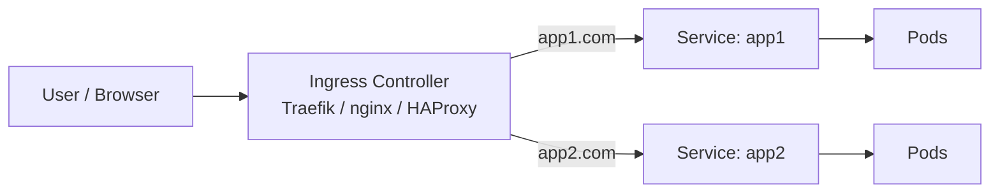
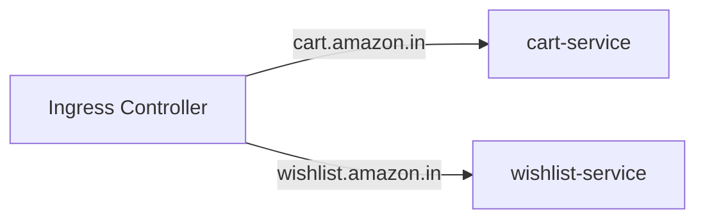
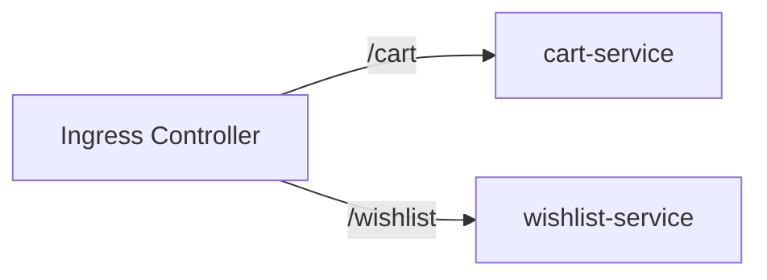
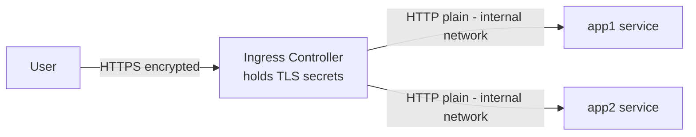
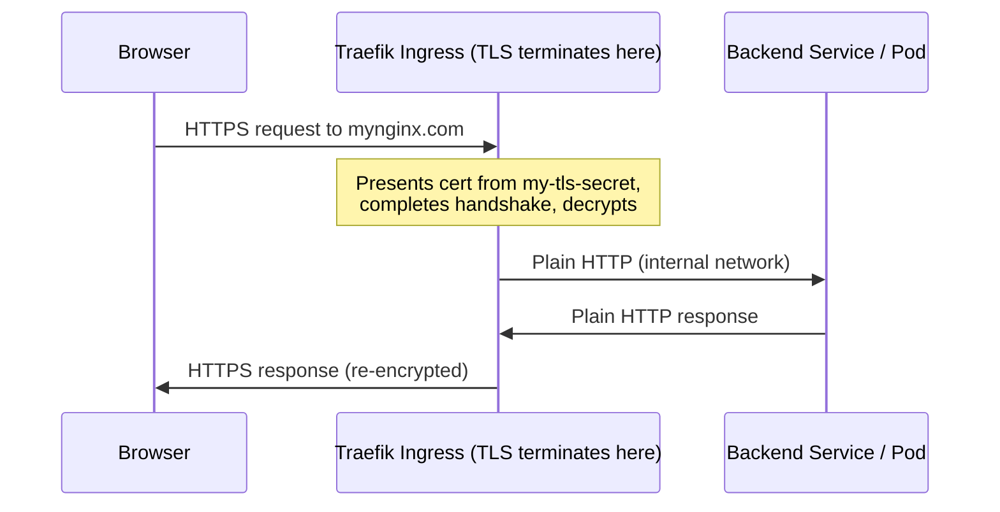

With the fundamentals and OpenSSL behind us, let's bring TLS into **Kubernetes**.

In this part:

- What **Ingress** and **Ingress controllers** are
- Host-based vs path-based routing
- **TLS termination (SSL offloading)** — and where to do it
- Creating a Kubernetes **TLS Secret**
- Configuring an Ingress to terminate TLS, with a **Traefik** walkthrough

---

## What is Ingress?

In Kubernetes, **Ingress** is an object that defines the **rules** for how external traffic reaches your apps — by hostname or URL path. Those rules are enforced by an **Ingress controller**: an actual running pod (Traefik, nginx, HAProxy, or a cloud load balancer) that reads Ingress objects and reconfigures itself automatically.



Without Ingress you'd expose each app via a NodePort or its own LoadBalancer. Ingress gives one smart entry point.

### Two ways to route

**Host-based (name-based):**



**Path-based:**



---

## The real question: is the traffic encrypted?

By default, traffic to backend pods is **unencrypted HTTP**. We want public-facing traffic to be **HTTPS**. So *where* should TLS be handled? Three patterns.

**A — TLS at the application:** each pod holds its own cert/key; encryption runs all the way to the app. Works, but every app must manage certificates.

**B — TLS at a reverse proxy:** certs live on a proxy in front; HTTPS to the proxy, plain HTTP internally.

**C — TLS at the Ingress controller (what we'll do):** since the controller is already the entry point, put the certificates there.



- **User → Ingress controller:** encrypted HTTPS (crosses the public network — must be secure).
- **Ingress controller → backend pods:** plain HTTP (stays inside the cluster network — acceptable).

This is **TLS termination (SSL offloading) at the Ingress controller**. The win: apps don't carry the encryption burden, and certificates live in **one** place.

> If you need encryption *all the way to the pod* (e.g. strict zero-trust / compliance), you'd use **end-to-end TLS** or a service mesh with mTLS instead — touched on in Part 8.

---

## Hands-on: terminate TLS at the Ingress

### 1. Get (or create) a certificate and key

For production you'd get a CA-signed cert (Part 5) or use cert-manager (Part 8). For this demo, a self-signed cert in one command:

```bash
openssl req -x509 -nodes -days 365 -newkey rsa:2048 \
  -keyout domain.key -out domain.crt
```

Set the **Common Name** to your domain (`mynginx.com`); for production include a proper SAN. You now have `domain.crt` and `domain.key`.

### 2. Install the Traefik Ingress controller

```bash
helm repo add traefik https://traefik.github.io/charts
helm repo update
helm install traefik traefik/traefik
```

Traefik's Service is a **LoadBalancer** — wait for its external IP.

### 3. Deploy the app and Service

A Deployment plus a **ClusterIP** Service. For example, the container listens on `5000`, and the Service exposes port `80` → targetPort `5000`.

### 4. Create the Kubernetes TLS Secret

A **Secret of type `tls`** holds the cert and key. Easiest — imperative:

```bash
kubectl create secret tls my-tls-secret \
  --cert=domain.crt --key=domain.key
```

Or declaratively (cert/key must be **base64-encoded** in YAML):

```yaml
apiVersion: v1
kind: Secret
metadata:
  name: my-tls-secret
type: kubernetes.io/tls
data:
  tls.crt: <base64-encoded-domain.crt>
  tls.key: <base64-encoded-domain.key>
```

> The imperative command base64-encodes for you — which is why it's the convenient choice.

### 5. Ingress — before TLS

```yaml
apiVersion: networking.k8s.io/v1
kind: Ingress
metadata:
  name: app-ingress
spec:
  rules:
    - host: mynginx.com
      http:
        paths:
          - path: /
            pathType: Prefix
            backend:
              service:
                name: connectedcity-service
                port:
                  number: 80
```

Apply it, map `mynginx.com` to Traefik's LoadBalancer IP (hosts file + `ipconfig /flushdns` on Windows), and visit. Over **HTTP** it works; over **HTTPS** you get *"certificate is not valid"* — no cert for your domain yet (Traefik serves its own default).

### 6. Ingress — with TLS termination

Add a `tls` section tying your host to the Secret:

```yaml
apiVersion: networking.k8s.io/v1
kind: Ingress
metadata:
  name: app-ingress
spec:
  tls:
    - hosts:
        - mynginx.com
      secretName: my-tls-secret      # cert + key for this host
  rules:
    - host: mynginx.com
      http:
        paths:
          - path: /
            pathType: Prefix
            backend:
              service:
                name: connectedcity-service
                port:
                  number: 80
```

```bash
kubectl apply -f ingress.yaml
```

Refresh over HTTPS. Because the cert is **self-signed**, the browser still warns — but inspect it and you'll see your issuer and that it's issued to `mynginx.com`. **TLS is terminating at the Ingress.** With a trusted-CA cert you'd get a clean padlock.



### Multiple domains, one controller

Create a TLS Secret per host and list each under `tls`:

```yaml
spec:
  tls:
    - hosts: ["x.com"]
      secretName: x-secret
    - hosts: ["y.com"]
      secretName: y-secret
  rules:
    - host: x.com
      http:
        paths:
          - path: /
            pathType: Prefix
            backend:
              service: { name: x-service, port: { number: 80 } }
    - host: y.com
      http:
        paths:
          - path: /
            pathType: Prefix
            backend:
              service: { name: y-service, port: { number: 80 } }
```

---

## Key takeaways

- **Ingress** defines routing; an **Ingress controller** enforces it and is the cluster's entry point.
- **TLS termination at the Ingress** keeps traffic encrypted from user to controller, then plain HTTP inside the cluster — apps stay certificate-free.
- A **`kubernetes.io/tls` Secret** stores the cert + key (base64); reference it from the Ingress `tls` section.
- Scales to many domains — one Secret per host.

But creating and rotating Secrets by hand doesn't scale. In **Part 8** we automate certificates with **cert-manager**, and cover **client certificates / mutual TLS (mTLS)** — including how the Kubernetes API server authenticates you.

*Previous: [Part 6 — Formats, Revocation, Let's Encrypt & HSTS «](/blog/tls-mastery-part-6-formats-revocation-letsencrypt-hsts) · Next: Part 8 — mTLS, Client Certs & cert-manager »*
